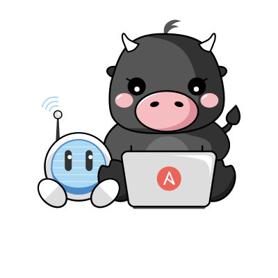

# Ansible AI Connect

This repository contains the application that serves Ansible task suggestions for consumption by the Ansible VS Code extension.

## Getting started

### Install dependencies
1. [Podman Desktop](https://podman-desktop.io/)
2. [Ollama](https://ollama.com/)
3. [VS Code](https://code.visualstudio.com/) and the [Ansible extension](https://marketplace.visualstudio.com/items?itemName=redhat.ansible)

### Start the model server
```bash
export OLLAMA_HOST=0.0.0.0
ollama serve &
ollama run mistral:instruct
```

### Set environment variables
Populate the `tools/docker-compose/.env` file with the following values:
```bash
DEPLOYMENT_MODE="upstream"
SECRET_KEY="somesecretvalue"
WCA_SECRET_BACKEND_TYPE="dummy"
# configure model server
ANSIBLE_AI_MODEL_MESH_CONFIG="..."
```
See the example [ANSIBLE_AI_MODEL_MESH_CONFIG](./docs/config/examples/README-ANSIBLE_AI_MODEL_MESH_CONFIG.md).

### Start service and dependencies

```bash
podman compose -f tools/docker-compose/compose.yaml --env-file ./.env up
```

### Configure VS Code to connect to your local machine

1. Navigate to `File (or Code on macOS) > Preferences (or Settings on macOS) > Settings`
1. Search for `Lightspeed`
1. For both **User** and **Workspace**, set the following setting values:
    1. `Ansible > Lightspeed`: `Enabled` :ballot_box_with_check:
    1. `Ansible > Lightspeed: URL`: `http://localhost:8000`
    1. `Ansible > Lightspeed: Suggestions`: `Enabled` :ballot_box_with_check:

### Stop service and dependencies
```bash
podman compose -f tools/docker-compose/compose.yaml down
```

## Development

### Project structure
| Path                            | Description                 |
|---------------------------------|-----------------------------|
| ansible_ai_connect              | Service backend application |
| ansible_ai_connect_admin_portal | Admin portal application    |
| ansible_ai_connect_chatbot      | Chatbot application         |

### Service configuration

### Secret storage
For most development usages, you can skip the call to AWS Secrets Manager
and always use the dummy `WCA_SECRET_BACKEND_TYPE` by setting the following in your
`tools/docker-compose/.env` file:

```bash
WCA_SECRET_BACKEND_TYPE="dummy"
WCA_SECRET_DUMMY_SECRETS="11009103:valid"
```

In this example, `11009103`` is your organization id. In this case the model is set to `valid`.
You can also use the following syntax to set both the model and set key_id:
`WCA_SECRET_DUMMY_SECRETS='11009103:ibm_api_key<sep>model_id<|sepofid|>model_name'`


For deployment and RH SSO integration test/development, add the following to your
`tools/docker-compose/.env` file:

```bash
DEPLOYMENT_MODE=saas
WCA_SECRET_MANAGER_ACCESS_KEY=<access-key>
WCA_SECRET_MANAGER_KMS_KEY_ID=<kms-key-id>
WCA_SECRET_MANAGER_PRIMARY_REGION=us-east-2
WCA_SECRET_MANAGER_REPLICA_REGIONS=us-west-1
WCA_SECRET_MANAGER_SECRET_ACCESS_KEY=<secret-access-key>
```
See [here](#aws-config) for details.

### Admin Portal
This repository also contains a React/TypeScript webapp for the "Admin Portal". This is located in the `ansible_ai_connect_admin_portal` directory. Further details can be found in `ansible_ai_connect_admin_portal/README.md`. If you wish to run the "Admin Portal" locally it is important to read the instructions.

### Chatbot
The `ansible_ai_connect_chatbot` directory contains
a React/TypeScript webapp
for the "Chatbot" UI.

Refer to
`ansible_ai_connect_chatbot/README.md` for further details.

## Debugging

The service can be run in debug mode by exporting or adding to the
command line the variable `DEBUG=True`.

The Django service listens on <http://127.0.0.1:8000>.

Note that there is no pytorch service defined in the `docker-compose`
file. You should adjust the `ANSIBLE_AI_MODEL_MESH_CONFIG`
configuration to point to an existing service.

## <a name="aws-config">Use the WCA API Keys Manager</a>

To interact with the WCA key management API, or use WCA commercial inference locally, you need to add the following
variables to you environment file:

```shell
WCA_SECRET_MANAGER_ACCESS_KEY=<AWS access key>
WCA_SECRET_MANAGER_SECRET_ACCESS_KEY=<AWS secret access key>
WCA_SECRET_MANAGER_KMS_KEY_ID=<KMS key id or alias>
WCA_SECRET_MANAGER_PRIMARY_REGION=us-east-2
WCA_SECRET_MANAGER_REPLICA_REGIONS=us-west-1
```

The AWS key and secret key must belong to a user who has both the `AnsibleWisdomWCASecretsReader` and
`AnsibleWisdomWCASecretsWriter` policies.

The KMS Secret needs to either be a multi region secret (when using the id) or a secret with the same name in the
primary and replica regions (when using the alias).

Note: when using a KMS key alias, prefix with `alias/<actual alias>`.

Refer to [the set up document](https://github.com/ansible/ansible-wisdom-ops/blob/main/docs/wca-vault.md) for the AWS accounts and secrets.

## Deploy the service via OpenShift S2I

```
oc new-build --strategy=docker --binary --name wisdom-service
oc start-build wisdom-service --from-dir . --exclude='(^|\/)(.git|.venv|.tox|model)(\/|$)' --wait=true
oc new-app wisdom-service
```

## Testing the completion API

The sample request below tests the task suggestion prediction API provided by the Django application. This is the same
request the VS Code extension will make.

Request:

```bash
# Post a request using curl
curl -X 'POST' \
  'http://127.0.0.1:8000/api/v0/ai/completions/' \
  -H 'accept: application/json' \
  -H 'Content-Type: application/json' \
  -d '{
    "prompt": "---\n- hosts: all\n  tasks:\n  - name: Install nginx and nodejs 12 Packages\n"
    }'
```

Response:

```json
{
  "predictions": [
    "- name: ansible Convert instance config dict to a list\n      set_fact:\n        ansible_list: \"{{ instance_config_dict.results | map(attribute='ansible_facts.instance_conf_dict') | list }}\"\n      when: server.changed | bool\n"
  ]
}
```

## Using pre-commit

Pre-commit should be used before pushing a new PR.
To use pre-commit, you need to first install the pre-commit package and its dependencies by running:

```bash
pip install .
```

To install pre-commit into your git hooks and run the checks on every commit, run the following each time you clone this
repo:

```bash
pre-commit install
```

To update the pre-commit config to the latest repos' versions and run the precommit check across all files, run:

```bash
pre-commit autoupdate && pre-commit run -a
```

## Updating the Python dependencies

We use [uv](https://github.com/astral-sh/uv) to manage Python dependencies,
following the same approach as [ansible-chatbot-stack](https://github.com/ansible/ansible-chatbot-stack).
All dependencies are defined in `pyproject.toml`.

To update the pinned dependencies, run:

```bash
make export
```

This will spin up a container and run the equivalent of:

```bash
uv lock --python 3.12
uv export --format requirements-txt --no-hashes -o requirements.txt
```

This generates:
- `uv.lock` - The lock file with exact pinned versions (commit this file)
- `requirements.txt` - Exported for pip compatibility

### Security constraints

Security-pinned transitive dependencies are defined in the `[tool.uv]`
section of `pyproject.toml` using `constraint-dependencies`. These constraints
are automatically applied when running `uv lock`.

### Development dependencies

Development dependencies (testing, linting, etc.) are defined as optional
dependencies in `pyproject.toml` under `[project.optional-dependencies]`.
Install them with:

```bash
pip install .[dev]
# or with uv:
uv pip install -e .[dev]
```

# Using the VS Code extension

Install the latest Ansible VS Code Extension from the [Visual Studio Marketplace](https://marketplace.visualstudio.com/items?itemName=redhat.ansible).

In order to successfully connect to your local dev environment using
the plugin, you need to create the OAuth2 application in Django. Open
a shell session in the Django container using

```bash
docker exec -it docker-compose_django_1 bash
```

and then run the Django command to create the application:

```bash
  wisdom-manage createapplication \
    --name "Ansible AI Connect for VS Code" \
    --client-id Vu2gClkeR5qUJTUGHoFAePmBznd6RZjDdy5FW2wy \
    --redirect-uris "vscode://redhat.ansible vscodium://redhat.ansible vscode-insiders://redhat.ansible code-oss://redhat.ansible checode://redhat.ansible" \
    public authorization-code
```

This sets up a matching client ID to the one that is coded directly
into the VS Code extension.

Review the screen recording for instruction on configuring the VS Code
extension to access your running wisdom service.

Note: If, after running ```python manage.py runserver``` you encounter an AssertionError, use the following
command: ```python manage.py runserver --noreload```. You can also disable it by
adding `INSTALLED_APPS = [i for i in INSTALLED_APPS if i not in ["django_prometheus"]]` to
the `ansible_wisdom/main/settings/development.py` file.

## Authenticating with the completion API

The wisdom service supports both GitHub and Red Hat authentication. GitHub authentication can be open to all
GitHub users, or limited to a specific team. The following directions are for configuring the service to grant
access to any GitHub user.

### Authenticate with GitHub

To test GitHub authentication locally, you will need to create a new OAuth App at
https://github.com/settings/developers. Provide an Authorization callback URL of
http://localhost:8000/complete/github/. Export Update `SOCIAL_AUTH_GITHUB_KEY` and
`SOCIAL_AUTH_GITHUB_SECRET` before starting your app. `SOCIAL_AUTH_GITHUB_KEY` and
`SOCIAL_AUTH_GITHUB_SECRET` correspond to the Client ID and Client Secret respectively,
both of which are provided after creating a new OAuth App. If you are running with the
compose [development environment](#development-environment) described below, put these
env vars in a .env file in the `tools/docker-compose` directory.

### Authenticate with Red Hat

To test Red Hat authentication locally, you will need to export 3 variables before start the application.

```bash
export SOCIAL_AUTH_OIDC_OIDC_ENDPOINT="https://sso.redhat.com/auth/realms/redhat-external"
export SOCIAL_AUTH_OIDC_KEY="ansible-wisdom-staging"
export SOCIAL_AUTH_OIDC_SECRET=secret_value
```

If, to run the application, you are using Makefile first two variables will be set automatically.
Third one should be set manually in either way: you are using Makefile or running
application directly. To get the secret value go to [AWS Secret Manager](https://auth.redhat.com/auth/realms/EmployeeIDP/protocol/saml/clients/itaws)
select `it-cloud-aws-ansible-wisdom-staging` to log in. Click on `Secrets Manager` than `wisdom` and at last
`Retrieve secret value` than copy value of `SOCIAL_AUTH_OIDC_SECRET`.

### After authentication

Once you start the app, navigate to http://localhost:8000/ to log in. Once authenticated, you will be presented with an
authentication token that will be configured in VS Code (coming soon) to access the task prediction API.

> **Warning:** The Django `runserver` command launches `ansible-wisdom-service` as http://127.0.0.1:8000. It is important that the host name used in your browser and that configured in GitHub OAuth Authorization callback URL are identical. Should you use Django's link the GitHub OAuth Authorization callback URL will need to use `127.0.0.1` in lieu of `localhost` too.

To get an authentication token, you can run the following command:

```bash
podman exec -it docker-compose-django-1 wisdom-manage createtoken --create-user
```

Note: If using `docker-compose`, the container might have a different name such as `docker-compose-django-1` in which
case the command would be:

```bash
podman exec -it docker-compose-django-1 wisdom-manage createtoken --create-user
```

- `my-test-user` will be create for you
- `my-token` is the name of the token

To get an authentication token without logging in via GitHub, you also:

1. create an admin user
2. navigate to http://localhost:8000/admin/
3. and log in with your superuser credentials
4. then navigate to http://localhost:8000/admin/oauth2_provider/accesstoken/
5. create a new token.

To test the API with no authentication, you can empty out `REST_FRAMEWORK.DEFAULT_PERMISSION_CLASSES` in base.py.

## Enabling postprocess with Ansible Lint

You can enable postprocess with [Ansible Lint](https://github.com/ansible/ansible-lint) for improving the completion output just by setting the environment variable `ENABLE_ANSIBLE_LINT_POSTPROCESS` to True
**Note:** Ansible lint post-processing is available only to commercial users.

## Application metrics as a Prometheus-style endpoint

We enabled the Prometheus endpoint to scrape the configuration and check the service status to build observability into
the service for monitoring and measuring its availability.

To provide feedback for operational needs as well as for continuous service improvement.

## Swagger UI, ReDoc UI and OpenAPI 3.0 Schema

### Swagger UI

Swagger UI is available at http://localhost:8000/api/schema/swagger-ui/ **in
the development environment only**.

- **Note:** It is not enabled in the production environment regardless of any settings.

If you want to test APIs using Swagger UI,

1. Open http://localhost:8000/ and get an authentication token by
   following the instructions described in the
   [Authenticating with the completion API](#authenticating-with-the-completion-api)
   section.
2. Open http://localhost:8000/api/schema/swagger-ui/
3. Click the **Authorize** button.
4. Input the authentication token for the tokenAuth as it is.
   You do not need to add any prefixes, such as `Bearer ` or `Token `.
5. Click **Authorize**.
6. Click **Close** to go back to the Swagger UI page.
7. Expand a section for the API that you want to try and click **Try it out**.
8. Input required parameters (if any) and click **Execute**.

### ReDoc UI

Another OpenAPI UI in the ReDoc format is also available at  http://localhost:8000/api/schema/redoc/
**in the development environment only**.

### OpenAPI 3.0 Schema

The static OpenAPI Schema YAML file is stored as
[/tools/openapi-schema/ansible-ai-connect-service.yaml](https://github.com/ansible/ansible-ai-connect-service/blob/main/tools/openapi-schema/ansible-ai-connect-service.yaml)
in this repository.

When you make code changes, please update the static OpenAPI Schema YAML file
with the following steps:

1. Ensure the API metadata (description, version, `TAGS` used to organize API categories) are accurate; this requires updating the [`SPECTACULAR_SETTINGS` variable](https://github.com/ansible/ansible_ai_connect/blob/main/ansible_wisdom/main/settings/development.py#L23-L36) in `ansible_wisdom/main/settings/development.py`.
2. Run the wisdom service locally.
3. Run `make update-openapi-schema` in the project root.
4. Commit the updated OpenAPI Schema YAML file with your API changes.

Also a dynamically generated OpenAPI 3.0 Schema YAML file can be downloaded either:

- Click the /api/schema/ link on Swagger UI, or
- Click the Download button on ReDoc UI

# Connect to additional model servers

## Connect to a local model server

To connect to the Mistal 7b Instruct model running on locally on [llama.cpp](https://github.com/ggerganov/llama.cpp) modelserver:

1. Download the Mistral-7b-Instruct [llamafile](https://github.com/Mozilla-Ocho/llamafile?tab=readme-ov-file#other-example-llamafiles)
1. Make it executable and run it (`$YOUR_REAL_IP` is your local IP address, NOT 127.0.0.1 or localhost)
   ```bash
   chmod +x ./mistral-7b-instruct-v0.2-Q5_K_M-server.llamafile
   ./mistral-7b-instruct-v0.2-Q5_K_M-server.llamafile --host $YOUR_REAL_IP
   ```
1. Set the appropriate environment variables
   ```bash
   ANSIBLE_AI_MODEL_MESH_CONFIG="..."
   ```
See the example [ANSIBLE_AI_MODEL_MESH_CONFIG](./docs/config/examples/README-ANSIBLE_AI_MODEL_MESH_CONFIG.md).

# Testing

## Test cases

Unit-tests are based on Python's [unittest library](https://docs.python.org/3/library/unittest.html#module-unittest) and
rely on [Django REST framework APIClient](https://www.django-rest-framework.org/api-guide/testing/#apiclient).

### Unit-test Guidelines

- Use `reverse()`:

  Please make use of Django's [reverse() function](https://docs.djangoproject.com/en/4.1/ref/urlresolvers/#reverse) to
  specify which view you are hitting.
  If and when we change the path some endpoint is at, the person making the change will appreciate not having to search
  and replace all of those strings.

  Additionally if you are hitting the same endpoint over a bunch of methods on the same test class, you can always store
  the results of `reverse()` in an attribute and make use of that, to reduce the repetition.

## Execute Unit Tests and Measure Code Coverage

### Preparation

For running Unit Tests in this repository, you need to
have backend services (Postgres, Prometheus and Grafana) running.
[Running them from container](#running-backend-services-from-container)
is one handy way for that requirement.

For getting the unit test code coverage,
install the `coverage` module with the instructions in the
[Using pre-commit](#using-pre-commit) section.

### Use make

The easiest way to run unit tests and measure code coverage report is to run

```bash
make code-coverage
```

If the execution was successful, results in HTML are showin in Chrome.

### Running Unit Tests from Command Line or PyCharm

For executing unit tests from command line,
You need to set some environment variables
that are read by the Service.
If you are using PyCharm
for development, you can use [the EnvFile plugin](https://plugins.jetbrains.com/plugin/7861-envfile)
with the following `.env` file:

```bash
LAUNCHDARKLY_SDK_KEY=flagdata.json
ANSIBLE_AI_DATABASE_HOST=localhost
ANSIBLE_AI_DATABASE_NAME=wisdom
ANSIBLE_AI_DATABASE_PASSWORD=wisdom
ANSIBLE_AI_DATABASE_USER=wisdom
DJANGO_SETTINGS_MODULE=ansible_wisdom.main.settings.development
PYTHONUNBUFFERED=1
SECRET_KEY=somesecret
```

It is recommended to use `make` to run unit tests since it helps to configure default values.
If you want to execute only specific file/class/method you can use $WISDOM_TEST variable:

```bash
make test
WISDOM_TEST="ansible_wisdom.main.tests.test_views.LogoutTest" make test
```

Alternatively if you want to run unit tests manually, export variables from `.env` as environment variables.
It can be done with following commands:

```bash
set -o allexport
source .env
set +o allexport
```

After that, it is possible to run tests using standard django test mechanism:

```bash
cd ansible_wisdom
python3 manage.py test
```

### Measuring Code Coverage from Command Line

If you want to get code coverage by
running unit tests from command line,
set environment variables listed in the section above
and run following commands:

```bash
cd ansible_wisdom
coverage run --rcfile=../setup.cfg manage.py test
```

After tests completed, run

```bash
coverage report
```

for showing results on console, or

```bash
coverage html
```

to generate HTML reports under `htmlcov` directory.

Alternatively you can run the following command for code coverage:

```bash
make code-coverage
```

# Utilities

## Backup/restore the database (Podman)

You can do a backup and restore the database with the following scripts:

- `./tools/scripts/dump-db.sh`
- `./tools/scripts/restore-db.sh`

E.g:

```bash
./tools/scripts/dump-db.sh /tmp/my-backup.dump
./tools/scripts/restore-db.sh /tmp/my-backup.dump
```

# Troubleshooting

## Permission denied errors

If you get a permission denied error when attempting to start the
containers, you may need to set the permissions on the
`ansible_wisdom/` and `prometheus/` directories:

```bash
chcon -t container_file_t -R ansible_wisdom/
chcon -t container_file_t -R prometheus/
chcon -t container_file_t -R grafana/
```

If your django container build fails with the following error, you've
probably run out of memory running webpack.
```bash
STEP 30/46: RUN npm --prefix /tmp/ansible_ai_connect_admin_portal run build

> admin-portal@0.1.0 build
> node scripts/build.js

Creating an optimized production build...
npm ERR! path /tmp/ansible_ai_connect_admin_portal
npm ERR! command failed
npm ERR! signal SIGKILL
npm ERR! command sh -c -- node scripts/build.js
```
You can increase the memory of your existing podman machine
by issuing the following:
```bash
podman machine set --memory 8192
```

Recreating the dev containers might be useful:

```bash
podman compose -f tools/docker-compose/compose.yaml down
```

It may be necessary to recreate the dev image if anything has changed in the nginx settings:

```bash
podman rmi localhost/docker-compose_django_1
```

## Too many open files error

If you encounter a 'too many open files' error when building containers or starting
the development environment, you must increase the maximum number of files a process
is allowed to open. On most platforms this is done using the `ulimit` command.

```bash
ulimit -n <a larger value>
```

ex: the following will set the number of allowed open files to the maximum
number for your platform and user:

```bash
ulimit -n unlimited
```
