# PyCharm Debug Setup for Wisdom Service

By Tami Takamiya (last update: 2023.9.1)

## Summary

This is a memo on how to debug Wisdom service using PyCharm. Even though I tested it with PyCharm on my Fedora 38 laptop, it should be able to be applied to other environments, e.g. VSCode + MacOS with minor modifications.

## Setup for Development

The [README.md](https://github.com/ansible/ansible-wisdom-service/blob/main/README.md) file in the [ansible/ansible-wisdom-service](https://github.com/ansible/ansible-wisdom-service) GitHub project describes the required steps for running Wisdom Service using docker (or podman)-compose. This document assumes that you have completed them and can run Wisdom Service using docker (or podman)-compose.

> [!NOTE]
> This document contains some duplicated information that is found in the README.md file.

Among the steps found in the README.md file, the [Authenticating with the completion API](https://github.com/ansible/ansible-wisdom-service?tab=readme-ov-file#authenticating-with-the-completion-api) section is important, i.e. you need to create your own OAuth App at [https://github.com/settings/developers](https://github.com/settings/developers).

> [!IMPORTANT]
> Initially we were using GitHub Team authentication. Now we support GitHub (without "Team") authentication and it is recommended to create your own OAuth App for GitHub authentication. Differences in setups for GitHub Team and GitHub authentications are in:  
> | Item | GitHub team | GitHub |
> |------|-------------|--------|
> | Authorization callback URL | http://localhost:8000/complete/github-team/ | http://localhost:8000/complete/github/ |
> | Environment variables |- SOCIAL_AUTH_GITHUB_TEAM_KEY<br>- SOCIAL_AUTH_GITHUB_TEAM_SECRET |- SOCIAL_AUTH_GITHUB_KEY<br>- SOCIAL_AUTH_GITHUB_SECRET |

### Install PyCharm

[PyCharm](https://www.jetbrains.com/pycharm/) is an IDE made by JetBrains  for Python development. Even though there is nothing wrong to use VSCode for Python development, if you are (were) a Java developer like me and familiar with IntelliJIDEA, you may like PyCharm over VSCode 😀

There are several ways to install PyCharm. If you are using RHEL, avoid installing using Snap because a debug feature cannot be installed if PyCharm is installed with Snap. I installed PyCharm using [JetBrains Toolbox](https://www.jetbrains.com/toolbox-app/).

> [!WARNING]
> I tried to install PyCharm using Flatpak on my Fedora 38 CSB (it is accessed from Applications > System Tools > Software) but the installation was not successful and installed Toolbox instead.

### podman-compose (or docker-compose) for running backend servers

Our docker-compose set up runs Wisdom Django service with several  backend services (Redis, Postgres, Prometheus and Grafana) in containers. For debugging Wisdom service, we want to run Wisdom service directly from code with running backend services in containers.

With [PR #89](https://github.com/ansible/ansible-wisdom-service/pull/89), we added a separate compose YAML file (compose-backends.yaml) and added two new Makefile targets for the new YAML file, i.e., for running backend services, type:
```bash
make start-backends
```
  
For stopping backend services, type:
```bash
make stop-backends
```

> [!NOTE]
> The volumes used by Postgres DB persist after stopping backends.

You can look at them with the podman volume ls command:  
```bash
podman volume ls
```
Output:
```bash
DRIVER      VOLUME NAME
local       b67b9220656a9a6d6c95c9dd4769d34fc3d2813491398c6d0c436d6c6069343d
local       bccb83160e96d816c6fc37ae212b008aa0cfffb69cc3fffc43528ef7d8626999
```

  
If you want to start your local wisdom-service from a clean state, remove them before running backends with the podman volume rm command: 

```bash
podman volume ls -q | xargs podman volume rm
```


## Run chcon (SELinux)

Although this instruction is for running Django service from source, you may want to run Django service from podman-compose (or docker-compose) using tools/docker-compose/compose.yaml file.  For running Django service from the compose file, you need to run following three chcon commands:

```bash
chcon -t container_file_t -R ansible_wisdom/
chcon -t container_file_t -R prometheus/
```

## PyCharm venv Setup

It is recommended to use a separate virtual environment for your development.  It can be configured with

1. Go to Settings page (on Linux it is File > Settings)
2. Open Project: ansible-wisdom-service > Python Interpreter and click Add Interpreter  
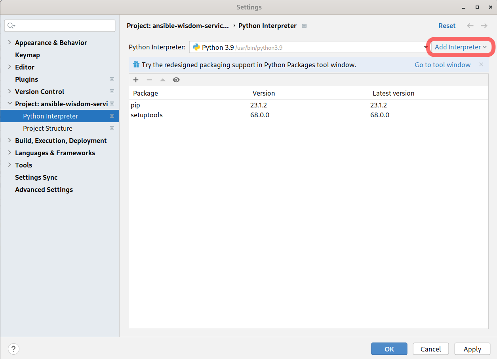
3. Select Virtual Environment and and set Base interpreter, then click OK  
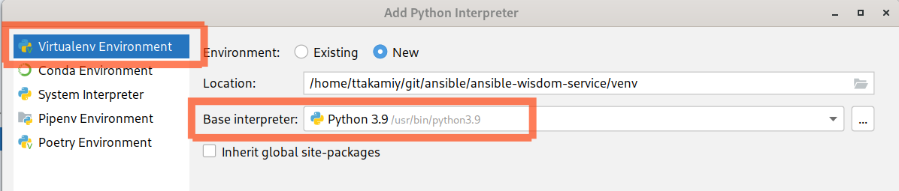

## PyCharm Run Configurations

We are going to create following run configurations:

1. migrate
1. createcachetable
1. createsuperuser
1. createapplication
1. runserver
1. runserver (grpc)
1. test

1-4 are for setup, 5 & 6 are for running Wisdom Service and 7 is for running unit tests.

### EnvFile

[EnvFile](https://plugins.jetbrains.com/plugin/7861-envfile) PyCharm plugin enables you to reuse the same set of environment variables.  As we create multiple run configurations, it is recommended to use the plugin. You can copy & paste following lines and add your GitHub key/secret to your .env file:

```bash
ANSIBLE_AI_DATABASE_HOST=localhost
ANSIBLE_AI_DATABASE_NAME=wisdom
ANSIBLE_AI_DATABASE_PASSWORD=wisdom
ANSIBLE_AI_DATABASE_USER=wisdom
ARI_KB_PATH=../ari/kb/
DJANGO_SETTINGS_MODULE=main.settings.development
ENABLE_ARI_POSTPROCESS=True
PYTHONUNBUFFERED=1
SECRET_KEY=somesecret
SOCIAL_AUTH_GITHUB_KEY=(your key here)
SOCIAL_AUTH_GITHUB_SECRET=(your secret here)
```

> [!TIP]
> For using a model server that provides prediction results, you need to set extra environment variables for a client type that is used to connect to the model server. Please take a look at the doc [Local Wisdom Server Setup with the gRPC or WCA clients](./grpc-wca-setup.md) for more details.

### migrate, createsuperuser and createapplication

In our standard compose file, Django’s DB migration (manage.py migrate) is automatically executed, but since it is removed in this backend server compose file, we need to manually execute DB migration before running the debug session.  

Also, it is desirable to have a superuser for using Django’s admin UI. It can be done with manage.py createsuperuser . 

Another setup required for using the local development environment with Ansible VSCode extension is the setup of an authentication application.  It is done by manage.py createapplication . 

These configurations are almost identical except for the argument given to manage.py, you can create one and copy it before creating another.  
  
To create the migrate configuration, go to Run > Edit Configurations on PyCharm.  On Configuration tab:  
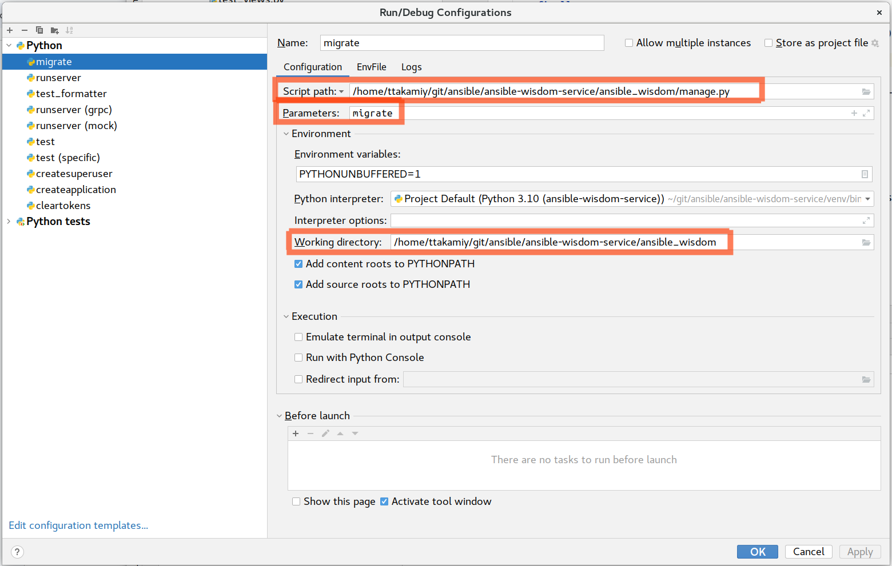

Script path: **(path to manage.py)**

Parameters: **migrate**

Working directory: **(path to ansible_wisdom directory of the project)**

And on the EnvFile tab:  
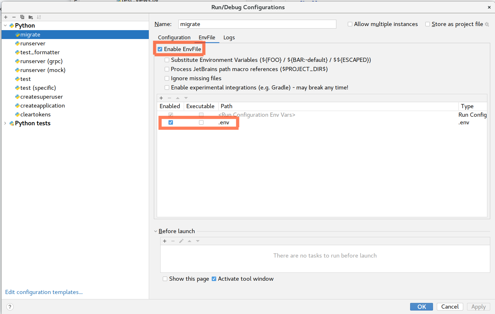

Enable EnvFile: checked

Then select your .env file in the list.

For creating the createcachetable configuration, 

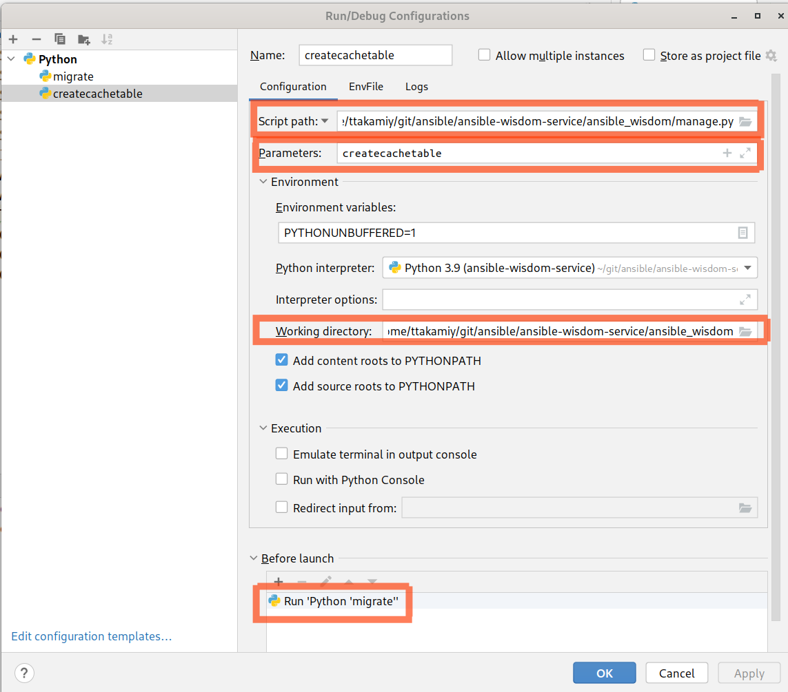  


Script path: **(path to manage.py)**

Parameters: **createcachetable**

Working directory: **(path to ansible_wisdom directory of the project)**

Before launch: select migrate configuration so that it will be executed before this  createsuperuser configuration is executed  

For creating the createsuperuser configuration, 

  
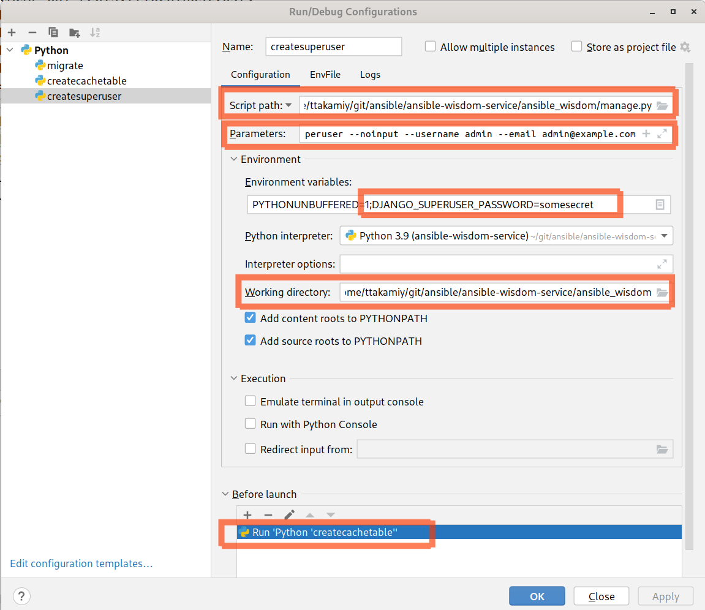

Script path: **(path to manage.py)**

Parameters: createsuperuser --noinput --username admin --email admin@example.com  
Environment variables: add ;make (or the superuser password you want to use)

Working directory: **(path to ansible_wisdom directory of the project)**

Before launch: select createcachetable configuration so that it will be executed before this createsuperuser configuration is executed.
  
The settings on the EnvFile tab are the same as the ones for the migrate configuration.

For creating the createapplication configuration:

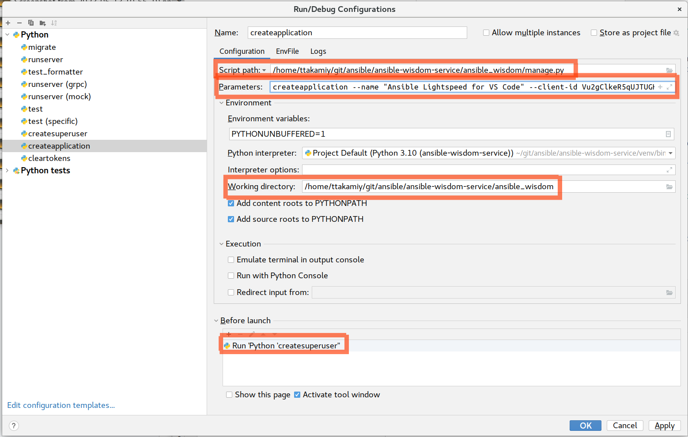

Script path: **(path to manage.py)**

Parameters: **createapplication --name "Ansible Lightspeed for VS Code" --client-id Vu2gClkeR5qUJTUGHoFAePmBznd6RZjDdy5FW2wy  --redirect-uris "vscode://redhat.ansible"   public authorization-code**
Working directory: (path to ansible_wisdom directory of the project) 

Before launch: select createsuperuser configuration so that it will be executed before this  createsuperuser configuration is executed  
  
The settings on the EnvFile tab are the same as the ones for the migrate configuration.

### runserver (grpc|wca)/test

For creating the runserver configuration:

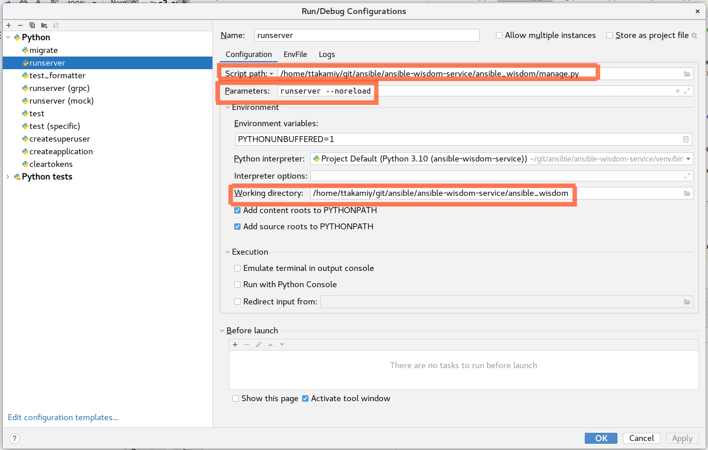  
  
Script path: (path to manage.py)

Parameters: runserver --noreload  
Working directory: (path to ansible_wisdom directory of the project) 

Depending on the client type for model server connection (either gRPC or WCA), you need to have a different set of environment variables. See [Local Wisdom Server Setup with the gRPC or WCA clients](./grpc-wca-setup.md) for more information.

The test configuration also uses a similar configuration to runserver.  Only difference is in the Parameters (test instead of runserver --noreload)  

### Tips to run specific test cases

If you specify only test in the Parameters, all unit test cases are executed. You can add a class or a method to the Parameters, you can limit the test cases to be executed.  For example, 

```bash
test users.tests.test_users.TestUserSeat
```

will execute tests defined in the TestUserSeat class only and  

```bash
test users.tests.test_users.TestUserSeat.create_user
```

will execute the create_user method only.

"Copy Reference" ("Copy/Paste Special > Copy Reference from the context menu or Ctrl+Alt+Shift+C in shortcut) is convenient to copy the fully qualified class/method name.

## Execution

Once both the migrate and runserver run configurations are created, make sure the backend servers are running in containers and run createapplication first from PyCharm’s Run > Run menu.  It will run DB migration, then create a superuser and an application that is required for authentication.

> [!IMPORTANT]
> If you removed persistent volumes before running backends, you need to run `createapplication` again to initialize DB.  

Then run `runserver` in Debug mode with PyCharms Run > Debug… menu. Console output would be like:  


```bash
/home/ttakamiy/git/ansible/ansible-wisdom-service/venv/bin/python /home/ttakamiy/git/ansible/ansible-wisdom-service/ansible_wisdom/manage.py runserver --noreload
Performing system checks...
System check identified no issues (0 silenced).
May 13, 2023 - 17:54:32
Django version 4.2, using settings 'main.settings.development'
Starting development server at http://127.0.0.1:8000/Quit the server with CONTROL-C.
```

If you open your web browser and point to [http://localhost:8000/](http://localhost:8000/), you see:

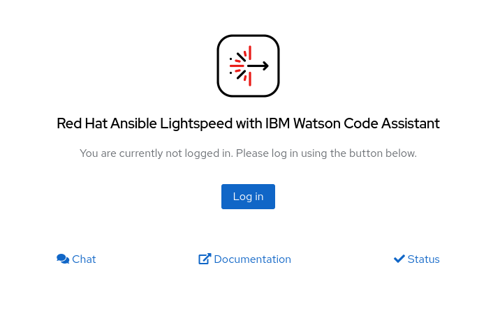

DON'T CLICK Log in HERE! If you do so, you'll see  
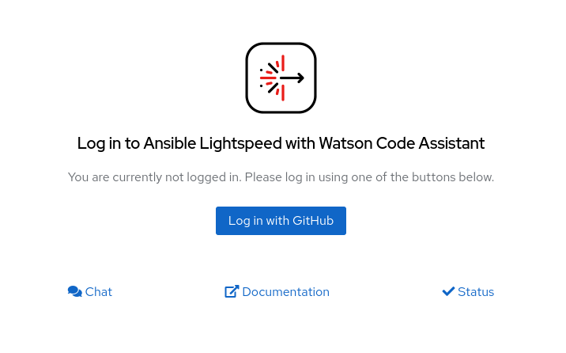

then you'll see

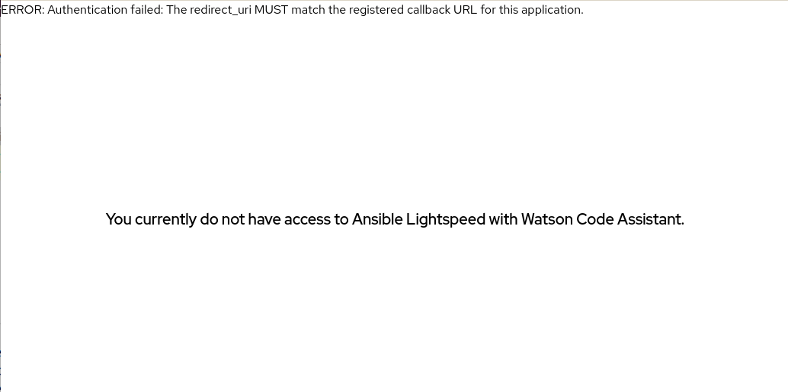

What you need is to open VSCode, install Ansible Plugin, and configure Lightspeed URL to [http://localhost:8000/](http://localhost:8000/) (note it's http, not https)  


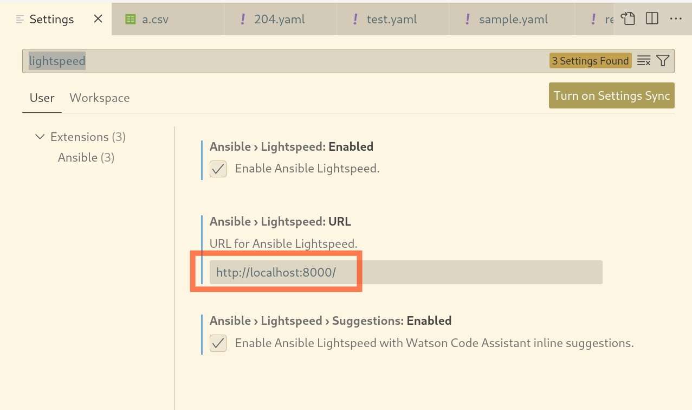

Click the Ansible icon and click Connect:

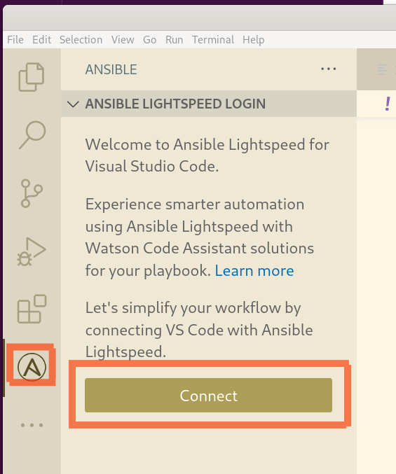

Click Allow to sign in:

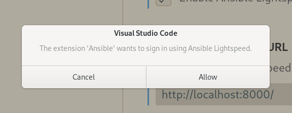

then you will see the login screen with  the "Log in with GitHub" button.  Click the button and it will guide you to the Terms of Use page, etc.

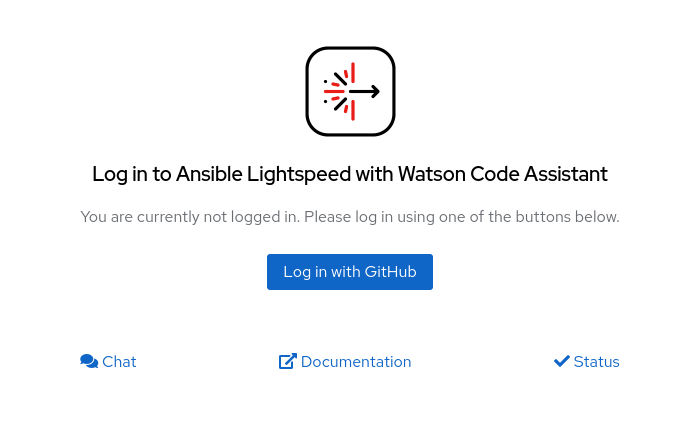

If everything went well, you'll see your GitHub ID on the web browser screen:

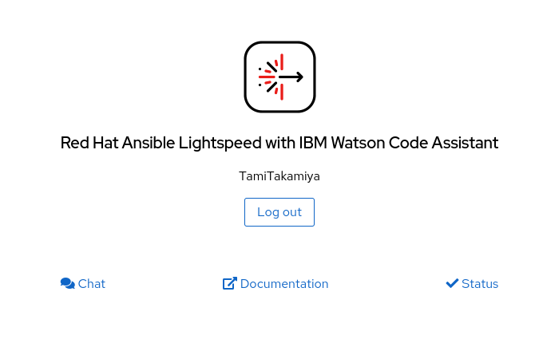

From that point, you can start debugging, i.e. set breakpoint, view variables etc. Have fun!
