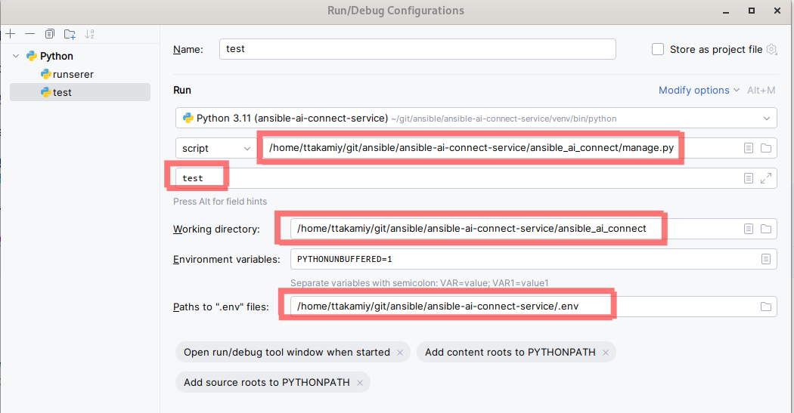

# PyCharm Debug Setup for Ansible AI Connect Service

By Tami Takamiya (last update: 2024.7.12)

## Summary

This is a memo on how to debug Ansible AI Connect service using PyCharm. Even though
descriptions here are very specific to PyCharm, you should be able to
apply them to other environments, e.g. VSCode + MacOS with minor modifications.

The instructions presented here were tested using
- PyCharm 2024.1.4 (Community Edition),
- Python 3.12.0,
- Fedora Linux 40 (Workstation Edition), and
- HP Victus Gaming Laptop 16

> [!NOTE]
> If you install Python on Fedora (or probably on other Linix distributions),
> you need to install the development package as well.  For Fedora, run
>
>   `sudo dnf install python3.11 python3.11-devel`

> [!NOTE] Content Matching and Playbook Generation/Explanation features are not available with
> this setup.

## Setup for Development

> [!NOTE]
> This document contains some duplicated information that is found in the README.md file.

### Model Server

This document assumes that you are using a local Ollama model server, whose setup procedure is described in
the
 [Start the model server](../README.md#start-the-model-server) section
of the README.md file.

### Install PyCharm

[PyCharm](https://www.jetbrains.com/pycharm/) is an IDE made by JetBrains for Python development. Even though there is nothing wrong to use
VSCode for Python development, if you are (were) a Java developer like me and familiar with IntelliJIDEA,
you may like PyCharm over VSCode 😀

There are several ways to install PyCharm. If you are using RHEL/Fedora, avoid installing using Snap because
a debug feature cannot be installed if PyCharm is installed with Snap. I installed PyCharm using
[JetBrains Toolbox](https://www.jetbrains.com/toolbox-app/).

> [!WARNING]
> I tried to install PyCharm using Flatpak on my Fedora 38, but the installation was not successful
> and installed Toolbox instead.

### podman-compose (or docker-compose) for running backend servers

Our docker-compose setup ([compose.yaml](../tools/docker-compose/compose.yaml)) runs Ansible AI Connect Django service with several backend services
(Postgres, Prometheus and Grafana) in containers. For debugging Ansible AI Connect service, we want to run Ansible AI Connect
service directly from code with running backend services in containers.

> [!NOTE]
> While docker-compose setup runs Ansible AI Connect Django service with uwsgi, the setup presented here
> does not use uwsgi and some behaviors at runtime are different.

With [PR #89](https://github.com/ansible/ansible-ai-connect-service/pull/89), we added a separate compose YAML file
([compose-backends.yaml](../tools/docker-compose/compose-backends.yaml)) and added two new
Makefile targets for the new YAML file, i.e., for running backend services, type:
```bash
make start-backends
```

For stopping backend services, type:
```bash
make stop-backends
```

> [!NOTE]
> The volumes used by Postgres DB persist after stopping backends.

You can look at them with the podman volume ls command:
```bash
podman volume ls
```
Output:
```bash
DRIVER      VOLUME NAME
local       b67b9220656a9a6d6c95c9dd4769d34fc3d2813491398c6d0c436d6c6069343d
local       bccb83160e96d816c6fc37ae212b008aa0cfffb69cc3fffc43528ef7d8626999
```


If you want to start your local ai-connect-service from a clean state, remove them before running backends
with the podman volume rm command:

```bash
podman volume ls -q | xargs podman volume rm
```


## Run chcon (SELinux)

Although this instruction is for running Django service from source, you may want to run Django service
from podman-compose (or docker-compose) using [tools/docker-compose/compose.yaml](../tools/docker-compose/compose.yaml) file.
For running Django service from the compose file, you need to run following chcon command:

```bash
chcon -t container_file_t -R ansible_ai_connect/
```

Also for running Prometheus from the compose file, you need to run the followng:
```bash
chcon -t container_file_t -R prometheus/
```

## PyCharm Python Setup

As of writing this (2024.7.12), the project is using Python version 3.11. It is recommended to use a separate virtual environment for your development. It can be configured with

1. Go to Settings page (on Linux it is File > Settings)
2. Open Project: ansible-ai-connect-service > Python Interpreter and click Add Interpreter
2. Open Project: ansible-ai-connect-service > Python Interpreter and click Add Interpreter
3. Select Virtual Environment and and set Base interpreter, then click OK

**It is also important to run**
```bash
pip3 install -e '.[test]'
```
This command set up your Python environment for development and test. It creates `venv/bin/wisdom-manage`
script, which is required to run some `Makefile` targets referenced in this document.


## One-time DB Setup

After starting backend services with `make start-backends` **for the first time after a new DB
is created**, run
```bash
make create-application
```
This will execute following four targets as dependencies defined in `Makefile` for one-time DB setup:

- `migrate`
- `create-cachetable` (depends on `migrate`)
- `create-superuser` (depends on `create-cachetable`)
- `create-testuser` (depends on `create-superuser`)
- `create-application` (depends on `create-testuser`)

These are needed for the following reasons:

- `migrate`: When Ansible AI Connect Service is running with docker (or podman) compose,
Django’s DB migration (manage.py migrate) is automatically executed,
but for running Ansible AI Connect Service from source, we need to manually
execute DB migration before running.
- `create-cachetable`: Since we use DB for caching
instead of a dedicated service such as Redis, a table for caching is need
to be created.
- `create-superuser`: This target creates a superuser for using Django’s admin UI.
- `create-testuser`: This target creates a test user (username/password = `testuser`/`testuser`),
which is used for your debugging.
- `create-application`: For using the local development environment with Ansible VSCode extension, the
setup of an authentication application is needed.

> [!WARNING]
> By default, `make create-superuser` creates a Django superuser with:
> - username: admin
> - email: admin@example.com
> - password: somesecret
>
> You can override the default password by defining the `DJANGO_SUPERUSER_PASSWORD`
> environment variable before running the command.
>
> For changing username and/or password for the test user, please edit `Makefile`.


## PyCharm Run Configurations

We are going to create following run configurations:

1. runserver
1. test

`runserver` is for running Ansible AI Connect Service and `test` is for running unit tests.

### .env

For reusing the same set of environment variables, it is recommended to define a `.env` file

> [!Note]
> Previous versions of PyCharm needed to use the [EnvFile](https://plugins.jetbrains.com/plugin/7861-envfile) PyCharm plugin for enabling `.env` file suport. Now PyCharm has its own built-in `.env` file support.

You can copy & paste following lines and add your GitHub key/secret to your .env file:

```bash
ANSIBLE_AI_DATABASE_HOST=localhost
ANSIBLE_AI_DATABASE_NAME=wisdom
ANSIBLE_AI_DATABASE_PASSWORD=wisdom
ANSIBLE_AI_DATABASE_USER=wisdom
DJANGO_SETTINGS_MODULE=main.settings.development
PYTHONUNBUFFERED=1
SECRET_KEY=somesecret
DEPLOYMENT_MODE=upstream
ANSIBLE_AI_MODEL_MESH_CONFIG="..."
```
See the example [ANSIBLE_AI_MODEL_MESH_CONFIG](./config/examples/README-ANSIBLE_AI_MODEL_MESH_CONFIG.md).

> [!TIP]
> The example referenced above uses local Ollama server with Mistral 7B Instruct model.
> For using a different type of model server that provides prediction results,
> you need to set extra environment variables for a client type that is used
> to connect to the model server.

### runserver configuration

Go to Run > Edit Configurations menu and create the `runserver` configuration:

- Script path: point to `ansible_ai_connect/manage.py`
- Script arguments: `runserver --noreload`
- Working directory: point to `ansible_ai_connect`
- Paths to '.env' files: path to point your `.env` file


### test configuration

The `test` configuration is similar to the `runserver` configuration. The only difference is
in Script arguments:

- Script path: point to `ansible_ai_connect/manage.py`
- Script arguments: `test`
- Working directory: point to `ansible_ai_connect`
- Paths to '.env' files: path to point your `.env` file




### Tips to run specific test cases

If you specify only test in the Parameters, all unit test cases are executed. You can add a class or a method to the Script arguments to limit the test cases to be executed.  For example,

```bash
test users.tests.test_users.TestUserSeat
```

will execute tests defined in the TestUserSeat class only and

```bash
test users.tests.test_users.TestUserSeat.create_user
```

will execute the create_user method only.

"Copy Reference" ("Copy/Paste Special > Copy Reference from the context menu or Ctrl+Alt+Shift+C in shortcut) is convenient to copy the fully qualified class/method name.

## Execution

Once both the runserver and test configurations are created, make sure the backend servers are running in containers and run `make create-application` if you have not executed it yet.

> [!IMPORTANT]
> If you removed persistent volumes before running backends, you need to run `make create-application` again to initialize DB.

Then run `runserver` in Debug mode with PyCharms Run > Debug… menu. Console output would be like:

```bash
import sys; print('Python %s on %s' % (sys.version, sys.platform))
/home/ttakamiy/git/ansible/ansible-ai-connect-service/venv/bin/python -X pycache_prefix=/home/ttakamiy/.cache/JetBrains/PyCharmCE2024.1/cpython-cache /home/ttakamiy/.local/share/JetBrains/Toolbox/apps/pycharm-community/plugins/python-ce/helpers/pydev/pydevd.py --multiprocess --qt-support=auto --client 127.0.0.1 --port 35229 --file /home/ttakamiy/git/ansible/ansible-ai-connect-service/ansible_ai_connect/manage.py runserver --noreload
Connected to pydev debugger (build 241.18034.82)
(...)
Performing system checks...
System check identified no issues (0 silenced).
June 28, 2024 - 16:56:26
Django version 4.2.11, using settings 'main.settings.development'
Starting development server at http://127.0.0.1:8000/
Quit the server with CONTROL-C.
```


If you open your web browser and point to [http://127.0.0.1:8000/](http://localhost:8000/), you see:


Instead clicking on the Login button here, open VSCode,
install Ansible Plugin, and configure Lightspeed URL
to [http://127.0.0.1:8000/](http://localhost:8000/) (note it's http, not https)


Click the Ansible icon and click **Connect**:


Click **Allow** to sign in:


then you will see the login screen.
Type Username/Password = testuser/testuser, then click the login button

> [!NOTE] Your browser may complain that the password is too simple  😀


Click **Authorize** on the Authorize Aunsible AI Connect for VS Code popup.


Click **Open Visual Studio Code - URL Handler** to complete the authenticaiton.


On VS Code, click **Open** to open the URI.


If the connection is established successfully, you will see username (`testuser`) on the sidebar
of VS Code.

> [!NOTE] Browser Screen shows the error message **Your organization doen's have access to Ansible AI Connect.**.
> You can ignore the message.


Now you can use Lightspeed's task completion feature and you can debug it with PyCharm Debugger!
